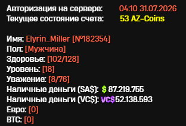
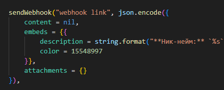
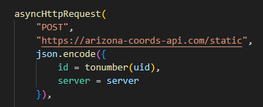

# Предназначение проекта

На стриме одного из ютуберов по Arizona-RP я заметил, то что есть скрипт, который позволяет делать все тоже самое что и мой:

- Искать клады, которые были уже кем-либо выкопаны.
- Сохранение статистики что было выкопано, кем и где.
- Команда /sos, которая позволяла всем тем, кто имеет скрипт - отправить свое местоположение по осям X Y Z.
- FastMAP, который позволяет смотреть текущее местоположение тех, кто активировал команду /sos (В папке map лежат все нужные элементы для правильного вывода. Их нужно закинуть в папку moonloader/map, чтобы скрипт мог их загрузить и правильно отобразить. Посмотреть FastMAP можно с помощью нажатия на клавишу 0).

# Структура проекта

В моем проекте есть три основные вещи:

1. База-данных
2. Вебхуки
3. Скрипт

## База-данных

База-данных используется для хранения всех кладов. Также с помощью базы-данных можно узнать координаты кладов, которые были выкопаны, а также посмотреть что было выкопано, кем и в какое время.

## Вебхуки

Вебхуки используются для отправки сообщений в Discord. Когда игрок выкапывает клад, скрипт отправляет запрос на сервер, чтобы отправить embed сообщение в Discord.

## Скрипт

Сам скрипт отвечает за все остальное. Он отвечает за отправку запросов на сервер, за получение координат кладов, за отправку сообщений в Discord, за получение статического ID игрока, за получение сервера игрока и т.д.

# Как настроить?

Доступ к скрипту:

- Если вы какому-либо человеку хотите выдать доступ к скрипту - вам нужно узнать его сервер, а также статический ID (ID, которые сохранен в базе данных как primarykey, и который не будет изменяться при перезаходе в игру) в игре (это можно сделать с помощью прописывания команды /stats в игре), там будет написан статический ID в скобках (на момент выкладывания этого README.md - система такая).
- 

---

Как сделать вебхук?

- Для начала нужно зайти на свой сервер в Discord
- Создать текстовый канал
- Нажать на шестеренку (настройки) у этого канала
- Открыть "Интеграция"
- Нажать "Вебхуки"
- Нажать "Новый вебхук"
- Скопировать ссылку на вебхук
- После чего вставить этот вебхук сюда:
- 

---

Как настроить свою ссылку?

- Почти все тоже самое, что и с вебхуками, только вам нужно заменить домен ссылки. Заменять нужно здесь, и во всех остальных местах, где есть "https://arizona-coords-api.com/", сами endpoint`ы не трогать:

- 
